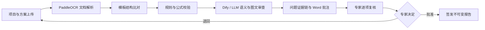
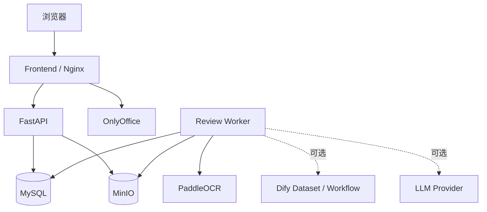

# SmartReview｜危大工程专项施工方案智能审查系统

SmartReview 是面向危险性较大的分部分项工程专项施工方案的 **AI 辅助审查平台**。系统将文档结构识别、规范语义审查、确定性规则与公式校验、人工专家复核、在线修订和正式签发串成完整闭环，并保留任务配置、问题证据、文档版本和操作审计记录。

> AI 输出只作为辅助审查线索。缺少方案原文定位、规范编号、条款号或条款原文的结果会被降级为“待人工判断”；只有专家完成复核与签发后，才形成正式人工结论。

## 系统能力

| 能力 | 当前实现 |
| --- | --- |
| 文档解析 | DOCX 经 LibreOffice 转为 PDF，由 PaddleOCR PP-StructureV3 识别标题、正文、表格与公式，再生成章节树；解析失败会明确报错，不静默切换解析器。 |
| 语义审查 | 按方案类型和章节配置提示词、引用章节、编制依据与 Dify Dataset；支持 Dify Workflow 全文审查及火山引擎、MiniMax、DeepSeek 等模型。 |
| 规范证据链 | 审查问题可记录方案原文、章节路径、页码、规范编号、条款号、条款原文、知识库片段及检索分数；证据缺失时强制提示人工核验。 |
| 图文材料 | 支持上传辅助文档与现场图片，提取 DOCX 内嵌图片，并将图片作为多模态输入交给按类型配置的 Dify Workflow。 |
| 计算校验 | 提供确定性规则与公式引擎、单位归一、参数范围、跨字段比较、公式计算、计算步骤与参数来源留痕。 |
| 专家复核 | 支持任务领取/释放、问题逐项处置、退回整改、复核、批准、OnlyOffice 在线修订及正式报告签发。 |
| 文档治理 | 原始方案、AI 批注版、专家编辑版和签发报告分别登记为不可变制品，记录 SHA-256、版本关系与操作审计。 |
| 任务治理 | 支持优先级、幂等提交、取消、重试、Worker 租约、技术状态/业务结论/结果完整性/人工状态分离。 |
| 运维安全 | 提供健康检查、HTTPS 入口、容器资源限制、日志轮转、可选 ClamAV 扫描、MySQL 与 MinIO 成套备份恢复。 |

### 关于三类智能审查要求

- **语义审查：已实现。** 可结合章节规则、编制依据、Dify 知识库与大模型定位疑似违规项并返回整改建议，是否达到业务精度取决于正式规范库、提示词和标注样本的质量。
- **图文一致性校验：具备接入链路。** 系统已经能够提取/上传图片并交给多模态 Workflow，但节点详图构件级识别、尺寸标注解析及与正文的专项确定性交叉规则，仍需针对具体危大工程类型继续配置和验收。
- **计算校验：引擎已实现。** 可执行单位换算、范围检查、字段交叉比较和受限安全公式；正式使用前仍需由专业人员录入并确认各方案类型的参数、阈值和计算公式。

## 审查流程



方案类型只有在模板、规则、Workflow 与外部集成通过就绪检查并正式发布后，才能创建正式审查任务。任务执行时会保存配置和输入快照，后续修改配置不会改变历史任务。

## 技术架构

| 层级 | 技术 |
| --- | --- |
| 前端 | React 19、TypeScript、Vite 8、Ant Design 6、TanStack Query、React Router |
| 后端 | Python 3.11、FastAPI、SQLAlchemy、Alembic、JWT |
| 数据与文档 | MySQL 8、MinIO、OnlyOffice Document Server |
| 智能处理 | PaddleOCR PP-StructureV3、Dify Dataset / Workflow、可配置 LLM |
| 运行方式 | Docker Compose、独立异步 Worker、Nginx 单入口 |



默认 Compose 仅向宿主机发布前端统一入口；API、MySQL、MinIO、OnlyOffice、Worker 与 PaddleOCR 均保留在容器网络内。维护端口需要显式叠加 `docker-compose.admin.yml`。

## 快速体验

只查看界面和演示审查闭环时，可启动不依赖外部 Dify/LLM 的离线演示：

```powershell
.\scripts\start_demo_mode.ps1
```

浏览器访问 `http://127.0.0.1:5173`。演示数据位于 `demo-data/` 与 `frontend/public/demo-assets/`。

## Docker 部署

### 1. 准备环境

- Docker Desktop 或 Docker Engine + Compose V2
- 根据 Compose 中的资源限制为 MySQL、OnlyOffice、PaddleOCR、API 与 Worker 预留足够内存；CPU 首次启动 PaddleOCR 时需要下载模型
- 一台可被浏览器访问的主机地址，填写到 `HOST_IP`，不要填写 `127.0.0.1`

### 2. 创建配置

```powershell
Copy-Item .env.docker.example .env.docker
```

至少修改以下项目：

- `HOST_IP`
- `MYSQL_ROOT_PASSWORD`、`MYSQL_PASSWORD`
- `MINIO_ROOT_PASSWORD`、`MINIO_APP_SECRET_KEY`
- `JWT_SECRET`
- `ONLYOFFICE_JWT_SECRET`
- 首次创建管理员所需的 `ADMIN_BOOTSTRAP`、`ADMIN_USERNAME`、`ADMIN_PASSWORD`

真实密码和 API Key 只能保存在被 Git 忽略的 `.env.docker` 或 `backend/.env` 中，禁止提交到仓库。

### 3. 启动完整基础栈

```powershell
docker compose --env-file .env.docker `
  -f docker-compose.yml `
  -f docker-compose.paddle.yml up -d --build
```

启动完成后访问 `http://HOST_IP/`。首次管理员创建成功后，应把 `ADMIN_BOOTSTRAP` 改回 `false` 并重新启动服务。

### 4. 检查服务

```powershell
docker compose --env-file .env.docker `
  -f docker-compose.yml `
  -f docker-compose.paddle.yml ps

Invoke-RestMethod http://127.0.0.1/api/health/live
Invoke-WebRequest http://127.0.0.1/api/health/ready -UseBasicParsing
```

完整生产 HTTPS、ClamAV、资源限制、备份和恢复步骤见 [部署与灾难恢复手册](docs/DEPLOYMENT_AND_RECOVERY.md)。

## 首次业务配置

1. 在“设置”中配置知识库、模型、审查参数和 OnlyOffice。
2. 新建方案类型并维护相应编制依据。
3. 上传 Word 模板，由 PaddleOCR 解析章节结构。
4. 配置章节提示词、引用关系、知识库、确定性规则和计算公式。
5. 按方案类型绑定并测试 Dify Workflow；提交就绪验证后发布。
6. 使用已知缺陷样本发起审查，核对问题、证据、批注和计算过程。
7. 由专家逐项处理问题，完成整改闭环和正式签发。

Dify 的 Dataset API Key 与 Workflow App Key 是两套独立凭据，不得混用。详细输入映射、严格 JSON 输出格式和联调方法见 [Dify Workflow 对接说明](docs/DIFY_WORKFLOW.md)。本仓库不包含 Dify 自身的部署编排。

## 配置与数据迁移

系统配置可导出为迁移包，包含方案类型、编制依据、项目、规则、公式、系统设置、Dify Profile、模板文件和清单：

```powershell
.\scripts\export-system-config.ps1 `
  -ApiBase http://127.0.0.1/api `
  -OutputDirectory D:\SmartReviewConfig
```

在目标系统导入：

```powershell
.\scripts\import-system-config.ps1 `
  -ApiBase http://127.0.0.1/api `
  -InputDirectory D:\SmartReviewConfig
```

导出 JSON 只记录外部服务是否已配置，不包含 API Key、JWT 或数据库密码明文；导入前须在目标环境的 `.env.docker` 中重新填写各类密钥。

配置迁移包不代替业务数据备份。MySQL 与 MinIO 必须使用成套备份脚本迁移，并校验 `manifest.json` 中的文件大小和 SHA-256：

```powershell
.\scripts\backup-smartreview.ps1 -BackupRoot D:\SmartReviewBackups
.\scripts\restore-smartreview.ps1 -BackupPath <备份目录> -VerifyOnly
```

恢复会覆盖目标环境数据，执行前请完整阅读 [部署与灾难恢复手册](docs/DEPLOYMENT_AND_RECOVERY.md)。

## 仓库结构

```text
backend/                    FastAPI、Alembic、审查服务、Worker 与测试
frontend/                   React 管理端、离线演示与 Playwright 测试
paddleocr/                  PP-StructureV3 服务镜像
deploy/                     HTTPS、初始化与恢复演练配置
scripts/                    启停、配置迁移、备份与恢复脚本
docs/                       部署、Dify、PaddleOCR 和实施状态说明
demo-data/                  无敏感信息的演示样本与审查成果
docker-compose*.yml         基础及 Paddle/生产/安全/维护叠加编排
```

## 开发与验证

本地后端安装、迁移与启动见 [backend/README.md](backend/README.md)，新手部署顺序见 [新手启动说明](docs/新手启动说明.md)。仓库 CI 包含：

- 前端依赖锁定安装、ESLint、TypeScript 和生产构建；
- 后端源码编译、Alembic 迁移和 pytest；
- 本地、维护及 HTTPS Compose 配置校验；
- Playwright 演示与真实环境 E2E 测试配置。

## 界面预览

| 数据分析 | 模板管理 |
| --- | --- |
|  |  |

| 规则配置 | 方案审查 |
| --- | --- |
|  |  |

| 人工审阅 | 在线预览 |
| --- | --- |
|  |  |

## 当前边界

- 仓库提供的是平台代码和演示配置，不包含各类危大工程的正式规范全文、生产规则阈值、完整计算公式或足量标注样本。
- 图纸构件级识别和工程类型专用图文交叉规则需要结合样本、模型和专业规则继续建设。
- 正式上线前必须完成专家验收、现行规范核验、HTTPS/防火墙配置、恶意文件扫描和异地备份恢复演练。
- 外部知识库或模型不可用时，系统会保留降级/失败状态，不会将未执行的审查显示为“全部通过”。

当前实施与验收记录见 [实施状态（2026-08-25）](docs/IMPLEMENTATION_STATUS_20260825.md)。

## License

[MIT License](LICENSE)
