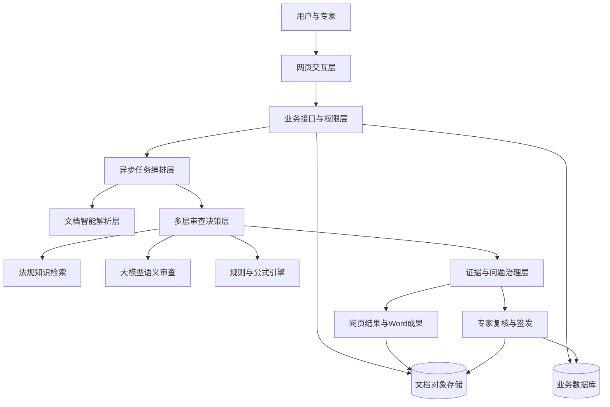
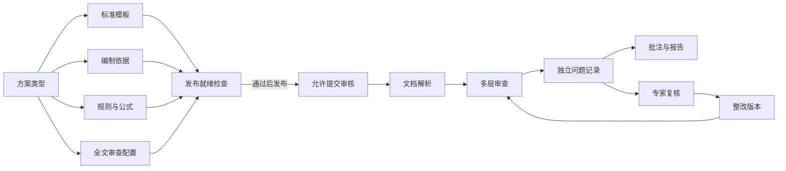
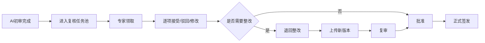

# 危大工程专项方案智能审查平台——PPT Markdown 文字稿大纲

> 建议篇幅：20～22页  
> 建议汇报时长：18～25分钟  
> 建议受众：项目评委、指导教师、工程管理人员、潜在试点单位  
> 核心结论：我们已经完成一条可以真实运行、可追溯、可扩展的智能审查技术链，并通过实际任务证明系统具备继续建设为工程应用产品的能力。

## 使用说明

- 每个“第X页”对应一张幻灯片。
- “页面文字”适合直接放入PPT，应尽量保持简洁。
- “讲解词建议”供汇报者练习，不建议全部堆在页面上。
- “视觉建议”用于后续制作PPT时选择截图、流程图或对比图。
- 正文不提及参考项目名称、仓库地址、对方页面名称或对方宣传表述。
- 涉及演示规则和法规阈值时必须说明“待专业人员核验”，不得把演示数据包装成正式工程结论。

---

## 第1页｜封面

### 页面标题

危大工程专项方案智能审查平台

### 页面副标题

面向方案解析、合规比对、参数验算与专家复核的工程智能审查系统

### 页面文字

- 汇报人：________
- 团队：________
- 日期：________

### 讲解词建议

本项目聚焦危大工程专项施工方案审查。我们的目标不是让大模型替代工程专家，而是把文档解析、规范比对、参数核验、问题定位、整改建议和人工复核组织成一条可追溯的数字化流程，帮助工程人员更快地发现问题，并让最终结论仍然由有权限的专业人员确认。

### 视觉建议

保持极简。使用施工现场或工程图纸的低对比度背景，叠加系统名称，不放功能列表。

---

## 第2页｜一句话说明我们做了什么

### 页面标题

把“人工翻阅整本方案”转化为“机器初审＋规则验算＋专家签审”

### 页面文字

输入：专项施工方案、辅助资料、现场图片、项目条件

处理：文档解析 → 多层审查 → 法规证据 → 参数验算 → 问题定位

输出：网页问题清单、AI批注Word、审查报告、专家复核记录

### 核心定位

AI辅助审查，不替代专家责任

### 讲解词建议

系统接收真实Word方案，把文档转成可以计算和检索的结构化数据。之后既使用大模型理解语义，也使用确定性规则处理章节、阈值和公式。所有结果最终进入专家复核闭环。这样既利用了大模型处理长文本的能力，又避免把模型生成内容直接当成正式工程结论。

### 视觉建议

使用一条从“方案文件”到“专家签发”的横向主流程，最多六个节点。

---

## 第3页｜项目说明：为什么要做

### 页面标题

危大工程方案审查的难点不只是“文件太长”，而是信息、规则与责任同时复杂

### 页面文字

- 方案体量大：章节、表格、公式、图片和附件相互关联
- 标准分散：国家标准、行业标准、地方要求和企业制度并存
- 经验依赖高：同一问题可能因审查人员不同而出现判断差异
- 参数易冲突：高度、跨度、间距、荷载等数据可能前后不一致
- 结果难追溯：问题、原文、法规依据、整改版本之间缺少统一链路
- 工期压力强：人工审查速度难以适应项目推进节奏

### 讲解词建议

传统方式中，审查人员不仅要阅读大量文字，还要在不同章节之间反复核对参数，并查找对应规范。真正的风险往往不是一句话明显错误，而是某个章节缺失、两个位置的数据冲突、验算条件不完整，或者结论找不到可靠的法规依据。因此，单纯做一个“上传文件后生成一段总结”的网页，并不能解决核心问题。

### 视觉建议

左侧展示厚重方案文档，右侧展示五类风险：遗漏、冲突、违规、计算错误、不可追溯。

---

## 第4页｜项目目标与边界

### 页面标题

目标是建立可信的辅助审查链，而不是追求一个看似智能的单点回答

### 页面文字

项目目标：

1. 让方案内容能够被机器准确读取和定位
2. 让审查过程同时具备语义理解与确定性判断
3. 让每条问题尽量关联方案原文和法规证据
4. 让整改、复审和签发形成闭环
5. 让不同危大工程类型可以复用同一技术底座

项目边界：

- 当前定位为AI辅助审查
- 正式结论必须由人工专家签发
- 演示阈值和规则不能直接用于真实施工

### 讲解词建议

我们把系统目标分成“机器能读、机器能查、代码能算、专家能审、过程能追”五个层次。这一边界非常重要：系统可以提高初审效率和标准一致性，但工程责任、标准适用性和现场条件判断仍然属于专业人员。

---

## 第5页｜系统现在能做到什么

### 页面标题

目前已经形成从上传到专家复核的端到端能力

### 页面文字

- 项目与方案版本管理
- Word转PDF与版面结构解析
- 模板结构和必备章节检查
- 编制依据、跨章节一致性和章节内容审查
- 大模型全文审查与结构化问题输出
- 参数抽取、单位归一、规则和公式验算
- 问题证据状态与人工判断边界
- AI批注Word与独立审查报告
- 专家领取、逐项处置、退回整改、复审、批准和签发
- Docker化部署、健康检查、备份与审计留痕

### 讲解词建议

这些能力不是静态页面展示。当前系统中，用户可以创建项目、上传方案并形成异步任务；后台完成解析和多层审查；结果写入网页和Word；问题自动进入专家任务池。管理员还可以管理方案类型、模板、法规依据、规则、公式、模型和外部服务配置。

### 视觉建议

建议放最新系统首页、方案审核页和专家复核页三张真实截图，避免使用概念效果图。

---

## 第6页｜演示流程

### 页面标题

一次完整演示可以沿着七个动作完成

### 页面文字

1. 登录系统并创建工程项目
2. 选择已发布的脚手架方案类型
3. 上传带缺陷的专项方案Word
4. 查看后台解析与审查进度
5. 进入人工审阅，逐层查看问题
6. 下载AI批注方案与Word审查报告
7. 进入专家复核任务池完成问题处置

### 讲解词建议

演示时不要只打开结果页面。建议从项目创建开始，说明为什么方案必须绑定项目、地区和版本；然后上传样本，让观众看到任务状态；最后展示网页问题、Word批注和专家复核。这样能证明系统不是一个独立问答页面，而是完整业务流程。

### 视觉建议

一张编号式流程图，右下角注明“任务10已真实跑通”。

---

## 第7页｜创新点总览

### 页面标题

创新不在于“使用了大模型”，而在于让多种能力相互约束

### 页面文字

创新点一：面向复杂工程文档的结构化解析链

创新点二：语义审查与确定性规则的双轨决策

创新点三：问题、原文、法规、计算过程的证据链

创新点四：方案类型级配置与发布门禁

创新点五：AI初审与专家签发的责任闭环

创新点六：文档、问题和整改版本的不可变留痕

### 讲解词建议

很多系统只强调模型能力，但工程应用更关心结果能否解释、能否复现、能否追责。我们的创新重点是把模型、知识库、规则、公式、文档定位和专家复核组合起来：模型负责理解，代码负责计算，证据负责约束，专家负责最终判断。

---

## 第8页｜创新点一：文档解析

### 页面标题

先理解文档结构，才能真正理解工程方案

### 页面文字

处理路径：

Word → PDF → 页面版面识别 → 标题树 → 正文/表格/公式 → 章节定位

关键能力：

- 保留章节层级，而不是只提取一整段纯文本
- 识别表格和公式，为参数校验提供基础
- 将问题回指到章节、段落和原文
- 为后续模板对照、跨章节比对和Word批注提供定位

### 讲解词建议

我们选择先把Word转换为PDF，再使用PaddleOCR进行统一解析。这使可编辑文档和复杂版面进入同一条解析链。系统不仅要得到文字，更要知道文字属于哪个章节、表格或公式。只有这样，审查结果才能告诉用户“问题在哪里”，而不是只给出一段无法核验的结论。

### 视觉建议

用同一页方案的“原文页面—结构树—问题定位”三段式示意。

---

## 第9页｜技术路线

### 页面标题

技术路线按照“解析、审查、约束、闭环”四个阶段展开

### 页面文字

阶段一：数据进入

- 主方案、辅助资料、现场图片、项目条件

阶段二：文档理解

- 格式转换、版面解析、章节树、表格和公式识别

阶段三：多引擎审查

- 模板结构、依据核对、章节一致性、内容理解、全文审查、规则公式

阶段四：治理闭环

- 证据分类、问题去重、Word输出、专家处置、整改复审、正式签发

### 讲解词建议

技术路线的核心是分阶段降低不确定性。先把文件变成结构化文档，再让不同审查引擎各自完成擅长的任务，之后对证据强度进行分类，最后进入人工闭环。任何必需步骤失败，系统都不会把结果伪装成“完整审查通过”。

### 视觉建议

四段式泳道图。每段只保留3～5个关键词。

---

## 第10页｜系统架构

### 页面标题

系统采用分层服务架构，计算、存储与外部能力彼此解耦

### 页面文字

### 架构层说明

- 交互层：登录、配置、任务、结果和专家页面
- 业务层：权限、项目、模板、规则、接口和状态控制
- 任务层：异步领取、超时、取消、重试和任务租约
- 智能层：文档解析、知识检索、大模型、规则公式
- 数据层：结构化业务数据与不可变文档版本
- 治理层：证据强度、专家决策、审计和正式签发

### 讲解词建议

网页不会直接把文件交给大模型。业务接口先保存项目和文档版本，再由后台任务编排不同服务。文档本体进入对象存储，业务关系和状态进入数据库。解析、模型和规则引擎可以分别升级，不需要推翻整个系统。专家复核和签发位于结果治理层，确保AI结果不会绕过人工责任。

### 视觉建议

实际制作PPT时用扁平分层架构图，不使用网页卡片式布局。

---

## 第11页｜各模块之间的逻辑关系

### 页面标题

每个模块既提供能力，也为下游模块提供约束条件

### 页面文字

### 逻辑原则

- 没有模板，不允许进行可靠结构审查
- 没有证据规则，不允许形成正式违规判定
- 没有完整配置，不允许发布方案类型
- 没有专家批准，不允许生成正式签发结论

### 讲解词建议

方案类型是配置中心。一个类型不是只有一个名称，而是绑定模板、依据、规则、公式和全文审查配置。就绪检查把这些条件变成发布门禁。发布后，用户提交的每一份方案都保存配置快照和版本关系，结果不会因为管理员后来修改规则而失去复现依据。

---

## 第12页｜多引擎如何分工

### 页面标题

让模型做理解，让规则做判断，让专家做最终裁决

### 页面文字

| 能力 | 最适合处理的问题 | 输出定位 |
|---|---|---|
| 文档解析 | 标题、正文、表格、公式、页面结构 | “内容在哪里” |
| 知识检索 | 查找相关规范片段和条款 | “依据是什么” |
| 大模型 | 长文本理解、缺陷描述、整改建议 | “问题意味着什么” |
| 规则引擎 | 必备章节、阈值、跨字段关系 | “条件是否满足” |
| 公式引擎 | 单位归一、计算过程、数值比较 | “计算是否通过” |
| 工程专家 | 适用性、现场条件、责任签发 | “最终如何认定” |

### 讲解词建议

这是系统可信性的关键。大模型不适合承担最终数值计算和法律责任，因此模型主要用于语义理解和候选参数提取。规则与公式引擎使用确定性代码，保存输入值、单位、公式步骤、阈值和结果。遇到证据不足的模型问题，系统明确标记为“疑似问题，待人工复核”。

---

## 第13页｜证据链设计

### 页面标题

系统关注的不只是“发现了什么”，还关注“凭什么这样判断”

### 页面文字

每条高可信问题应包含：

- 方案原文：章节、页码、段落或表格单元格
- 规范证据：标准名称、编号、版本、条款号和条款原文
- 检索信息：知识库版本、片段编号和相关度
- 判定方式：模型推理、确定性规则或公式验算
- 整改建议：修改方向与需要补充的资料
- 人工状态：待核验、已接受、已驳回或已整改

证据不足时：

疑似问题 → 人工判断 → 不直接认定为正式违规

### 讲解词建议

系统后端会对问题证据进行分类。只有方案证据和法规条款达到要求时，才具备较强的形式判定基础。否则页面用中文明确显示“尚未核验”“需要专业人员判断”。这种设计比单纯追求问题数量更符合工程审查的责任要求。

### 视觉建议

用一条问题记录展开为“原文—法规—计算—建议—专家决定”五段证据链。

---

## 第14页｜专家复核闭环

### 页面标题

AI发现问题只是开始，整改与签发才构成完整业务闭环

### 页面文字

### 页面强调

- 每个问题独立保存
- 每次处置记录人员和时间
- 原始版、AI版、整改版、专家版、签发版分别保存
- 已签发文件禁止覆盖

### 讲解词建议

系统把专家复核做成真实流程，而不是一个“查看结果”按钮。专家可以领取任务，对每条AI问题进行接受、驳回或修改，必要时退回整改并复审。最终签发时记录签发人、时间和报告哈希，形成审计留痕。

---

## 第15页｜部署与运行架构

### 页面标题

容器化部署让系统可以在单机演示，也可以继续扩展到企业内网

### 页面文字

当前运行服务：

- 网页服务
- 后端业务接口
- 异步任务处理器
- 关系数据库
- 文档对象存储
- 在线文档服务
- 文档智能解析服务

运行保障：

- 服务健康检查
- 数据库版本迁移
- 任务超时、取消、重试和租约
- 文档版本哈希和审计事件
- 数据库与文档成套备份
- 可叠加HTTPS、病毒扫描和内部端口隔离

### 讲解词建议

当前七个核心容器服务均可在Docker环境运行。网页只公开一个入口，业务服务、数据库和存储可以保持在内部网络。对外部模型和知识库采用配置化对接，因此既可以使用团队现有服务，也可以在后续试点中替换为企业内部模型。

---

## 第16页｜实测范例：任务10

### 页面标题

任务10证明系统已经完成真实文件的端到端审查

### 页面文字

测试输入：带预设缺陷的脚手架专项施工方案

实测结果：

- 技术处理状态：成功
- 结果完整性：完整
- 审查结论：发现问题
- 问题总数：27条
- 全文语义审查问题：4条
- 规则与公式问题：2条
- 跨章节一致性问题：1条
- AI批注Word：实际写入21处可定位批注
- 输出成果：独立审查报告＋AI批注方案＋专家复核任务

### 页面结论

系统已经不是页面原型，而是一条真实运行的技术链

### 讲解词建议

任务10使用实际Word文件运行。系统识别出工程概况24米与施工工艺26米之间的冲突；确定性公式也对26米输入和24米演示阈值进行了计算比较；最终生成27条问题，其中21条能够定位并写入Word批注。全文审查返回4条结构化问题，并完整保留“方案原文”和“法规依据”。

### 视觉建议

放四张真实证据：任务状态、问题详情、Word批注、专家任务池。数字只使用本次实测结果。

---

## 第17页｜如何证明我们具备充分完成任务的能力

### 页面标题

完成能力由“需求覆盖、真实运行、工程质量、扩展路径”四组证据共同证明

### 页面文字

| 任务要求 | 当前证据 | 判断 |
|---|---|---|
| 文档解析引擎 | Word转PDF并由PaddleOCR解析标题、表格、公式 | 已跑通 |
| 核心审查流程 | 六个中文审查阶段与异步任务编排 | 已跑通 |
| 知识与模型接入 | 全文审查成功返回结构化问题；知识库具备真实检索测试 | 已接入，检索配置待修复 |
| 规则与公式 | 必备章节规则、参数记录、单位归一、公式比较 | 已实现演示闭环 |
| 数据库与接口 | 项目、版本、任务、问题、专家决策、审计记录 | 已实现 |
| Word成果 | AI批注版、独立报告、专家版和签发版机制 | 已实现 |
| 专家复核 | 领取、处置、整改、复审、批准、签发 | 已实现 |
| 部署配置 | 七个容器健康运行、迁移、备份、恢复与健康接口 | 已实现 |
| 数据批处理 | 规则与公式Excel预览和导入能力 | 已实现基础能力 |
| 工程质量 | 后端112项测试通过；前端检查与生产构建通过 | 已验证 |

### 讲解词建议

我们不以“页面数量”证明完成度，而是逐项对应任务要求。每个模块都有可运行接口、数据库记录或实际输出文件。与此同时，我们不掩盖尚未完成的部分：当前正式可演示类型只有脚手架，知识库目录可访问但真实检索失败，演示规则仍需专业人员核验。这种可验证、可边界化的状态说明团队已经掌握核心技术，也清楚产品化需要补齐什么。

---

## 第18页｜市场价值分析

### 页面标题

市场价值来自“缩短初审时间、统一审查标准、沉淀组织知识”

### 页面文字

目标用户：

- 施工总承包与专业承包单位
- 工程咨询、设计和监理机构
- 建设单位工程管理部门
- 大型企业内部技术中心
- 行业监管和质量安全管理场景

核心价值：

- 效率价值：机器完成首轮筛查，专家集中处理高风险问题
- 质量价值：减少遗漏，强化跨章节参数一致性检查
- 管理价值：模板、法规、规则和历史问题成为组织资产
- 合规价值：问题与依据可追溯，降低结论来源不清的风险
- 协同价值：编制、审核、整改、复审和签发在同一链路完成

### 讲解词建议

这一产品的价值不应简单表述为“替代多少人”。更合理的定位是提高专家时间的利用效率，把重复检查交给系统，把复杂判断留给专业人员。同时，企业可以把分散在个人经验中的审核要点沉淀为模板、规则、公式和缺陷样本，形成可持续更新的数字资产。

### 视觉建议

用“效率、质量、合规、知识资产”四象限，不给出未经调研的市场规模数字。

---

## 第19页｜可落地的产品与商业路径

### 页面标题

先以单一类型完成试点，再复制到六类危大工程和更多文审场景

### 页面文字

第一阶段：单类型试点

- 选定脚手架或高支模
- 完成专家规则核验和样本标注
- 评估准确率、证据完整率与审查时间

第二阶段：企业内部平台

- 扩展六类危大工程
- 建立企业模板、标准和审批权限
- 对接项目管理与档案系统

第三阶段：能力复制

- 方案变更审查
- 技术交底资料检查
- 合同与招采文件审查
- 企业制度和质量文件审查

可选交付方式：企业内网部署、项目级试点、年度软件服务、规则与知识库建设服务

### 讲解词建议

我们的扩展方式不是为每种方案重写一套网站，而是在同一平台上新增类型配置包。每个配置包包含模板、法规、规则、公式、全文审查配置和测试样本。这样可以先做深一个类型，再复制通用底座，降低后续扩展成本。

---

## 第20页｜如何衡量试点是否成功

### 页面标题

用可测指标验证价值，而不是只看模型回答是否“像专家”

### 页面文字

建议试点指标：

- 问题召回率：已标注缺陷中系统发现的比例
- 问题准确率：系统问题被专家接受的比例
- 证据完整率：具有原文定位和法规条款的问题比例
- 参数正确率：抽取数值、单位和来源均正确的比例
- 审查时长：人工全量审查与AI辅助审查的时间差
- 整改闭环率：问题完成整改并通过复审的比例
- 系统稳定性：任务成功率、超时率、并发能力和恢复时间

### 页面强调

每类方案至少准备合规样本和缺陷样本，由专业人员形成标准答案

### 讲解词建议

系统是否有价值，最终要通过专家标注数据验证。建议每种方案准备不少于20份样本，并覆盖合规、常见缺陷和严重缺陷。除了准确率，还要评估证据完整性、参数来源、实际节省时间和系统稳定性。

---

## 第21页｜当前不足与下一步

### 页面标题

核心技术链已经形成，下一阶段重点是专业数据和规模化验证

### 页面文字

当前不足：

- 目前只有脚手架类型形成完整演示配置
- 演示法规关联、阈值和公式尚未完成正式专家核验
- 网站可读取知识库目录，但真实片段检索仍需修复
- 页码、表格单元格和图片问题定位仍可进一步提升
- 尚缺六类方案的成套标注样本和业务验收记录
- 正式上线仍需域名、HTTPS、权限边界和异地备份

下一步优先级：

1. 修复真实法规检索并建立结构化证据链
2. 完成脚手架规则和公式的专业验收
3. 建立专家标注集和准确率评估
4. 依次扩展深基坑、高大模板、起重吊装、拆除和暗挖
5. 开展真实项目试点与运维安全验收

### 讲解词建议

这一页要主动说明边界。我们已经证明系统架构、开发和对接能力，但真实工程应用还依赖专业资料和试点数据。下一步不是继续堆页面，而是提高法规证据质量、完成专家规则核验、建立标注样本，并在真实项目中验证准确率和效率。

---

## 第22页｜结论

### 页面标题

我们已经搭好可信审查的技术底座，下一步是把专业知识变成可验证的生产能力

### 页面文字

我们已经完成：

- 一条真实运行的端到端审查链
- 一套模型、知识、规则和公式协同的技术架构
- 一套问题证据、Word成果与专家复核闭环
- 一套能够扩展到多种危大工程的配置机制

我们下一步需要：

- 专业规则核验
- 高质量标注样本
- 多类型复制
- 真实项目试点

### 收束句

让AI负责发现和整理，让规则负责计算和约束，让专家负责最终判断。

### 讲解词建议

综上，我们已经从“能不能做出页面”推进到“能不能跑通真实任务、保留证据并进入专家闭环”。系统已经具备继续完成项目任务的技术能力。下一阶段的决定性工作，是与专业团队共同把法规、规则、公式和样本做深，并通过真实项目形成可以量化的业务价值。

### 视觉建议

以“AI发现—规则约束—专家签发”三个关键词收束，不使用普通“谢谢观看”页面作为最后结论。

---

# 附录A｜建议准备的真实截图

1. 登录页或数据看板
2. 方案类型的发布与就绪检查
3. Word模板解析后的章节树
4. 规则与公式配置页
5. 知识库真实检索测试按钮
6. 方案上传与项目版本信息
7. 任务10的六阶段审查结果
8. 24m与26m跨章节冲突
9. 规则与公式验算过程
10. AI批注Word
11. 独立Word审查报告
12. 专家复核任务池与逐项处置页
13. 七个容器服务健康状态

# 附录B｜答辩时可重点强调的证据

- “我们展示的不是静态数据，任务10可以在数据库中查询到完整任务、问题和专家复核记录。”
- “Dify全文审查实际返回4条结构化问题，网站已经兼容其方案原文与法规依据结构。”
- “确定性公式保留输入参数、单位、阈值和比较结果，不依靠模型心算。”
- “AI批注Word实际写入21处可定位批注，其余问题保留在独立审查报告中。”
- “任何必需步骤缺失或外部服务失败时，系统会显示部分完成或不可用，不会误报完整通过。”
- “后端112项自动化测试通过，前端代码检查、类型检查和生产构建通过。”

# 附录C｜可能被问到的问题与简答

## Q1：大模型会不会胡说？

会存在这一风险，所以系统不把模型文本直接当成正式结论。问题需要关联方案原文和法规依据；参数和公式由确定性代码复核；证据不足的问题标记为疑似问题并进入人工复核。

## Q2：为什么不直接微调模型？

当前阶段先使用提示词、知识检索、规则和结构化输出验证业务闭环。这种方式迭代更快，也能先积累高质量标注数据。未来只有在样本规模、标签质量和收益评估充分时，再考虑微调。

## Q3：系统和普通聊天机器人有什么不同？

普通聊天机器人主要给出文本回答；本系统具备项目版本、文档解析、模板规则、公式验算、证据状态、Word成果、专家复核、审计和签发等工程业务能力。

## Q4：目前能审查所有危大工程吗？

技术底座可以扩展，但当前只有脚手架完成演示配置。其他类型必须补齐模板、法规、规则、公式和测试样本后才能发布，系统不会用空配置假装具备审查能力。

## Q5：如何证明结果可信？

从三个层面证明：第一，问题能够回指方案原文；第二，法规和公式能够保留来源与过程；第三，所有问题必须进入专家复核和审计链，正式结论由人工签发。

## Q6：最大的商业壁垒是什么？

不是单一模型，而是经过专家验证的模板、法规条款、规则、公式、缺陷样本和整改历史，以及这些资产在业务流程中的持续反馈。

## Q7：系统下一步最需要什么？

最需要专业人员提供和核验规则、公式、法规适用性以及标注样本，同时需要真实项目试点来评估准确率、证据完整率和节省时间。

# 编写依据（不建议放入PPT正文）

- 当前系统源代码与数据库模型
- `README.md`
- `操作说明书.md`
- `docs/IMPLEMENTATION_STATUS_20260825.md`
- 任务10真实运行结果及其Word成果
- 用户提供的同类系统本地参考副本，仅用于核对通用架构思路；本文未复用其品牌、页面文案和专有模块名称
